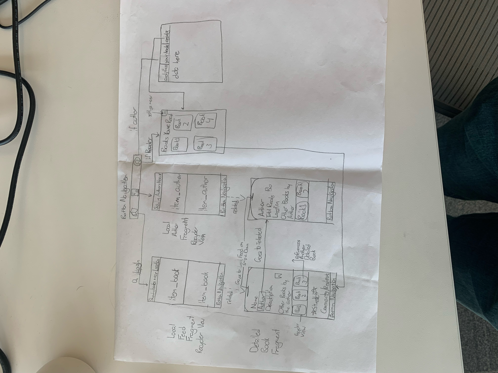
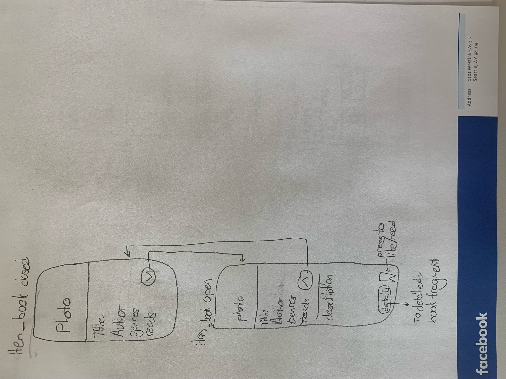

# Local Reads

## Table of Contents
1. [Overview](#Overview)
1. [Product Spec](#Product-Spec)
1. [Wireframes](#Wireframes)
2. [Schema](#Schema)

## Overview
### Description
LocalReads is the app for book lovers to find local authors and storytellers. LocalReads allows local authors to share their recent books to people in their area and create coffee chats/book circles. The app also allows book lovers to directly contact local authors to answer their questions.

### App Evaluation
[Evaluation of your app across the following attributes]
- **Category:** Entertainment/Education
- **Mobile:** Real-time/push notifications
- **Story:** The app is valuable to people who use the internet regularly and want a discussion about books. My parents would love an app like this.
- **Market:** The potential user base is a subsection of social media users. The app is not meant to be a general social media app. The app provides great value to those who are looking to discussing their book ideas. The audience is quite well defined although non-book readers are encouraged to join.
- **Habit:** Hopefully a user will open the app at least once a day (on the train or during lunch), although the app is not meant to addictive to the point of being destructive. This is done through the removal of a like system and limited push-notifications. 
- **Scope:** The required features of the app should not be too challenging to complete. The striped down app with just required features is still interesting to complete and use. The app I want to create is well defined.

## Product Spec

### 1. User Stories (Required and Optional)

**Required Must-have Stories**

* User can see local authors
* User can see local authors' books
* User can create an account (include location)
* User can login
* User can register as an author 
* User can chat with authors
* User can see their active chats
* Author can post a book to the app

**Optional Nice-to-have Stories**

* User can see authors upcoming books
* Author can create an upcoming book 
* User can chat with other users
* User can see what books they have read(User profile page)
* User can review books
* Share functionality

### 2. Screen Archetypes

* Login Screen
   * First thing the user sees when they are unregistered
* New Releases Feed
   * Shows the newest releases in the users area 
* Detail Book
   * Shows a detailed frame of the book
* Local authors feed
   * Shows a feed of local authors
* Detail author
   * Shows a detailed view of an author
* Chats feed
   * Shows a feed of all of a users chats
* Detail Chat
   * Where the user can actually chat

### 3. Navigation

**Tab Navigation** (Tab to Screen)
* New Releases Feed
* Chat
* Author
* (Stretch) Upcoming books 

**Flow Navigation** (Screen to Screen)
* New Releases
   * Detail book
* Detail Book
   * Detail Author
* Author Feed
   * Detail Author
* Author Detail
   * Detail Chat
   * Detail Book
* Chats Feed
   * Detail Chat
* Detail Chat

## Wireframes
[Add picture of your hand sketched wireframes in this section]

### [BONUS] Digital Wireframes & Mockups

### [BONUS] Interactive Prototype

## Schema 
[This section will be completed in Unit 9]

### Models
[Add table of models]

Book
|Property|Type|Description|
|--------|----|-----------|
|description|String|description of the book|
|genre|String|genre of the book|
|link|String|link to the book|
|reads|int|number of reads the book has|
|name|String|name of the book|
|image|ParseFile|image of the book|
|author|Author|author of the book|

Author
|Property|Type|Description|
|--------|----|-----------|
|username|String|username of the author|
|profilePic|ParseFile|PFP of the author|
|location|GeoPoint|Location of the author|
|books|List <String>|Array of booksIds|
|bio|String|Short bio of the author|
|link|String|Link to authors page on another website|
|reads|int|Total number of reads the author has|

Reader
|Property|Type|Description|
|--------|----|-----------|
|username|String|username of the reader|
|profilePic|ParseFile|PFP of the author|
|location|GeoPoint|Location of the reader (Google API generated)|
|favoriteGenres|List <String>|Favorite genres of the reader|

   
 

### Networking
- [Add list of network requests by screen ]
- [Create basic snippets for each Parse network request]
- [OPTIONAL: List endpoints if using existing API such as Yelp]
